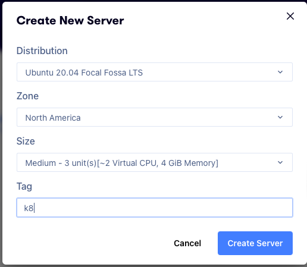
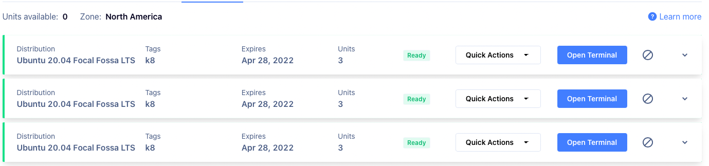

# K8s on acloudguru

There's a million ways to install and get started with kubernetes, this will be a guide I write to always go back to with all the commands to install a cluster.

## Cluster

This will be a simple 3 node cluster, we will have 1 control plan and 2 worker nodes. We will taint the control plane so it doesn't run any containers.

Why 3 nodes? acloudguru allows you 9 "units" to spin up cloud servers. We will be using the medium tier which is 3 units per server


## Install methods

https://kubernetes.io/docs/tasks/tools/

The various ways to install kubernetes is above, we will be using the kubeadm method as we're doing a 3 node cluster

## Build Servers

We log in to ACG then go to the playground and switch to the cloud servers tab. Click the new server button and use these settings below. Create 2 more instances with the same setting



It should look like this in the end



Log in to each of the servers and update all the packages

```bash
sudo apt update && sudo apt upgrade -y
```

Now lets run through this check found [here](https://kubernetes.io/docs/setup/production-environment/tools/kubeadm/install-kubeadm/)

| Task                    | Link to Description | Notes | Checkbox |
|-------------------------|---------------------|-------|----------|
| A compatible Linux Host | Test                | Test  |          |

- [ ] Compatible Linux Host 
- [ ] 2GB or more of RAM per machine
- [ ] Full network connectivity between all machines
- [ ] Unique hostname, mac address and product_uuid for every node
- [ ] Certain ports are open on your machines
- [ ] Swap disabled

Once we get through the checklist let's start installing kubernetes